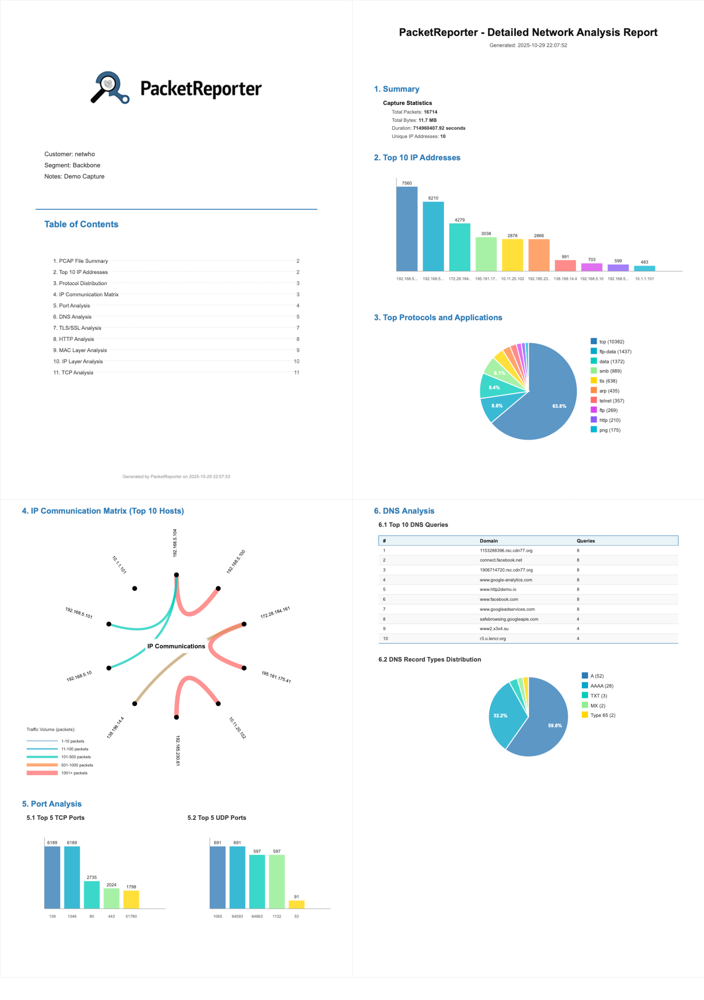

# PacketReporter

[](CHANGELOG.md)
[](CHANGELOG.md)
[](LICENSE)
[](https://www.wireshark.org/)
[](https://www.lua.org/)
[](installers/macos/)
[](installers/linux/)
[](installers/windows/)

A Wireshark plugin for generating network analysis reports with visualizations and PDF export.

> **⚠️ Beta Status**: This is version 0.2.0, a public beta release. While functional, the software is not yet production-ready. Please report any issues you encounter.

> **⚠️ Important**: This plugin requires external tools for SVG and PDF handling. Please review the [Platform Prerequisites](PLATFORM_PREREQUISITES.md) documentation and check your platform's [installer documentation](installers/) before installation to ensure all dependencies are available.
>
> **Windows Users**: Ensure external tools are added to your system PATH. You may briefly see command prompt windows flash during startup and report generation—this is expected behavior and purely cosmetic.
> (I could impplement a more silent behaviour by invoking a VBScript Wrapper - Not worth it on my opinion)

## ✨ Features

- 📊 **Multiple Report Types** - Summary, Detailed Analysis with 11 comprehensive sections
- 📈 **Rich Visualizations** - Bar charts, pie charts, circular communication matrix
- 📄 **Multi-page PDF Export** - A4 and Legal paper sizes with intelligent page breaks
- 🎯 **Filter Support** - Works seamlessly with Wireshark display filters
- 🔍 **Deep Protocol Analysis** - DNS, TLS/SSL, HTTP, TCP, UDP, MAC layer statistics
- 🚀 **Wireshark Integrated** - Pure Lua implementation running directly from Wireshark
- 💾 **Auto-save Reports** - Automatically saves to ~/Documents/PacketReporter Reports/
- ⚡ **Fast Performance** - Efficient packet processing with Wireshark Listener API

## 📸 Screenshots

### PacketReporter Menu

Access the plugin from the Wireshark menu:
```
Tools → PacketReporter → Detailed Report (A4)
```



*Example of generated report with comprehensive network analysis and visualizations*

## 🚀 Quick Start

### Installation

**Platform-specific one-line installers:**

**macOS:**
```bash
curl -sSL https://raw.githubusercontent.com/netwho/PacketReporter/main/installers/macos/install.sh | bash
```

**Linux:**
```bash
curl -sSL https://raw.githubusercontent.com/netwho/PacketReporter/main/installers/linux/install.sh | bash
```

**Windows (PowerShell):**
```powershell
iwr -useb https://raw.githubusercontent.com/netwho/PacketReporter/main/installers/windows/install.ps1 | iex
```

**Or manual install:**
```bash
git clone https://github.com/netwho/PacketReporter.git
cd PacketReporter

# macOS/Linux
./installers/macos/install.sh  # or ./installers/linux/install.sh

# Windows (PowerShell)
.\installers\windows\install.ps1
```

### Usage

1. **Load a capture file** in Wireshark
2. **Apply filter** (optional): `tcp or udp`
3. **Generate report**: Tools → PacketReporter → Detailed Report (A4)
4. **Export PDF**: Click "Export PDF" button
5. **View report**: PDF opens automatically in ~/Documents/PacketReporter Reports/

See [QUICKSTART.md](QUICKSTART.md) for detailed guide.

## 🎨 Cover Page Customization

Detailed reports (A4 and Legal) include a professional cover page with:
- Your company/organization logo
- Custom 3-line description
- Table of contents with page numbers
- Timestamp

**Customize your reports** by editing files in `~/.packet_reporter/`:

```bash
# Edit the description (3 lines max)
vi ~/.packet_reporter/packet_reporter.txt

# Replace the logo with your own
cp /path/to/your/logo.png ~/.packet_reporter/Logo.png
```

**Example description format:**
```
Customer: Acme Corporation
Segment: Production Network
Notes: Quarterly Security Audit
```

The cover page is automatically generated when you export a detailed report. If logo file is not found, it defaults to text-based branding.

## 📋 Report Types

### Summary Report
Quick overview with essential statistics and key charts (1-2 pages).

### Detailed Report  
Comprehensive analysis with 11 major sections (3-8 pages):

1. **PCAP File Summary** - File info, timestamps, capture statistics
2. **Top 10 IP Addresses** - Most active endpoints visualization
3. **Protocol Distribution** - Traffic composition analysis  
4. **IP Communication Matrix** - Circular visualization of host communications
5. **Port Analysis** - TCP/UDP port statistics with charts
6. **DNS Analysis** - Resource record types, authoritative responses, domain tables
7. **TLS/SSL Analysis** - Protocol versions, SNI names, certificate analysis
8. **HTTP Analysis** - User agents, hosts, status code distribution
9. **MAC Layer Analysis** - Frame sizes, traffic types, vendor identification
10. **IP Layer Analysis** - TTL distribution, fragmentation statistics
11. **TCP Analysis** - Window sizes, segment distribution, RTT samples

## 📚 Documentation

- **[QUICKSTART.md](QUICKSTART.md)** - 5-minute getting started guide
- **[PROJECT_OVERVIEW.md](PROJECT_OVERVIEW.md)** - Architecture and technical details
- **[CONTRIBUTING.md](CONTRIBUTING.md)** - How to contribute
- **[CHANGELOG.md](CHANGELOG.md)** - Version history

## 🛠️ Requirements

### Required
- Wireshark 4.0 or later (includes Lua 5.2+)

### Optional (for PDF export)
- `rsvg-convert` (recommended) or `inkscape` or `imagemagick`
- `pdfunite` (recommended) or `pdftk`

**macOS:**
```bash
brew install librsvg poppler
```

**Linux (Debian/Ubuntu):**
```bash
sudo apt install librsvg2-bin poppler-utils
```

## 🎯 Use Cases

## 💡 Example Workflows

**Network Security Assessment:**
```bash
# Analyze suspicious traffic
Filter: tcp.flags.syn==1 && tcp.flags.ack==0
Report: Detailed Report → Check Port Analysis & IP Matrix
```

**Web Application Monitoring:**
```bash
# Examine HTTP traffic
Filter: http
Report: Detailed Report → Review HTTP Analysis section
```

**DNS Troubleshooting:**
```bash  
# Investigate DNS issues
Filter: dns
Report: Detailed Report → Check DNS Analysis tables
```

## ⚙️ Technical Details

- **Language**: Pure Lua 5.2+
- **Lines of Code**: ~1,936
- **Data Collection**: Wireshark Listener API (taps)
- **Chart Format**: SVG (Scalable Vector Graphics)
- **PDF Engine**: Multi-converter support (rsvg/inkscape/imagemagick)
- **Performance**: Linear scaling with packet count

## 🎨 Custom Reports & Vector Graphics

All visualizations are generated as **SVG (Scalable Vector Graphics)**, providing high-quality vector output perfect for:

- 📄 **Custom Documentation** - Import charts into your own reports and presentations
- 🖼️ **Publication Quality** - Scale to any size without quality loss
- ✏️ **Easy Editing** - Modify colors, labels, and styles in vector editors (Inkscape, Adobe Illustrator)
- 📊 **Professional Reports** - Combine multiple charts in your preferred layout

**SVG Files Location**: `~/Documents/PacketReporter Reports/` (alongside PDF reports)

**Use Cases**:
- Security audit reports
- Network documentation
- Academic papers
- Technical presentations
- Compliance documentation

All charts (bar charts, pie charts, circular matrices) are saved as individual SVG files, making it easy to cherry-pick specific visualizations for your custom reports.

## 🐛 Troubleshooting

### 1. Summary Report

Quick overview of network traffic with essential statistics and visualizations.

**Includes:**
- Total packets, bytes, and duration
- Top 10 IP addresses (bar chart)
- Protocol distribution (pie chart with legend)
- Top 5 TCP ports (bar chart)
- Overview statistics panel

**Best for:** Quick traffic assessment, executive summaries

### 2. Traffic Matrix (Communication Matrix Report)

Beautiful circular visualization showing network communication patterns (from the existing Circle View project).

**Includes:**
- Dual circle view (IP addresses and MAC addresses)
- Smart node placement (communicating pairs positioned opposite)
- Top 50 conversations table
- Traffic intensity heat map (color-coded by volume)

**Best for:** Understanding communication patterns, identifying hotspots

### 3. Detailed Report

Comprehensive analysis based on Tranalyzer's reporting template.

**Includes:**
- **Summary Section**: Overview statistics
- **Top 10 IP Addresses**: Most active endpoints
- **Top Protocols**: Distribution of network protocols
- **Port Analysis**: Top 5 TCP and UDP ports (side-by-side charts)
- **DNS Analysis**:
  - Top 10 DNS queries
  - Top resolved IPv4/IPv6 addresses
- **HTTP Analysis**:
  - Top 10 User-Agents
  - Top 10 HTTP hosts
  - HTTP status code distribution
- All sections with appropriate charts (bar/pie) and legends

**Best for:** In-depth investigation, documentation, compliance reporting

## Installation

### Prerequisites

**Required:**
- Wireshark 4.0 or later
- Lua (included with Wireshark)

**Optional (for PDF export):**
- rsvg-convert (recommended - fastest)
- Inkscape (alternative)
- ImageMagick (alternative)

### Quick Install

1. **Copy plugin file to Wireshark plugins directory:**

   ```bash
   # macOS/Linux
   cp packet_reporter.lua ~/.local/lib/wireshark/plugins/
   
   # Windows
   copy packet_reporter.lua %APPDATA%\Wireshark\plugins\
   ```

2. **Install PDF converter (recommended):**

   ```bash
   # macOS
   brew install librsvg
   
   # Ubuntu/Debian
   sudo apt install librsvg2-bin
   
   # Fedora/RHEL
   sudo dnf install librsvg2-tools
   
   # Windows
   # Download from https://github.com/miyako/console-rsvg-convert
   ```

3. **Restart Wireshark**

### Verify Installation

1. Open Wireshark
2. Go to **Help → About Wireshark → Folders**
3. Verify plugins directory location
4. Go to **Tools** menu
5. You should see: **PacketReporter** with submenus

## Usage

### Basic Workflow

1. **Load/Capture Traffic**
   - Open a capture file or start live capture
   
2. **Apply Filter (Optional)**
   - Use any Wireshark display filter to focus analysis
   - Example: `ip.addr == 192.168.1.0/24 && http`
   
3. **Generate Report**
   - Go to **Tools → PacketReporter**
   - Choose report type:
     - **Summary Report** - Quick overview
     - **Detailed Report** - Comprehensive analysis
   
4. **Export to PDF**
   - Click **Export PDF (A4)** or **Export PDF (Legal)**
   - PDF saved to your HOME directory
   - Filename format: `PacketReport-YYYYMMDD-HHMMSS.pdf`

### Traffic Matrix

The Traffic Matrix visualization is available as **Tools → Communication Matrix Report** (separate menu entry from the original plugin).

## Paper Size Options

Both A4 and Legal paper sizes are supported:

- **A4**: 210mm × 297mm (794 × 1123 pixels @ 96 DPI)
  - Standard international paper size
  
- **Legal**: 8.5" × 14" (816 × 1344 pixels @ 96 DPI)
  - US legal document size
  - More vertical space for longer reports

Choose the paper size when exporting to PDF using the corresponding button.

## Chart Types

### Bar Charts
- Used for: IP addresses, ports, DNS queries, HTTP hosts
- Features: Colored bars, value labels, axis labels
- Legend: Optional (context-dependent)

### Pie Charts
- Used for: Protocol distribution, HTTP status codes
- Features: Color-coded slices, percentage labels
- Legend: Always included with counts

### Circular Diagrams (Traffic Matrix)
- Used for: Communication patterns
- Features: Curved chords, traffic intensity colors, smart layout

## Report Sections Explained

### Summary Report Sections

1. **Overview Statistics Box**
   - Blue-bordered summary panel
   - Key metrics at a glance
   
2. **Top 10 IP Addresses**
   - Most active endpoints
   - Packet count visualization
   
3. **Protocol Distribution**
   - Pie chart with legend
   - Shows traffic composition
   
4. **Top 5 TCP Ports**
   - Common services identified
   - Port number labels

### Detailed Report Sections

Structured similarly to Tranalyzer's output:

1. **Summary** - Overview statistics
2. **Top 10 IP Addresses** - Most active hosts
3. **Top Protocols and Applications** - Traffic breakdown
4. **Top 5 Ports**
   - 4.1 Top 5 TCP Ports
   - 4.2 Top 5 UDP Ports
5. **DNS Analysis**
   - 5.1 Top 10 DNS Queries
   - 5.2 Top DNS IPv4/6 Addresses
6. **HTTP Analysis**
   - 6.1 Top 10 HTTP User-Agents
   - 6.2 Top 10 HTTP Hosts
   - 6.3 Top 5 HTTP Status Codes

## Limitations

Due to Wireshark Lua API constraints, some planed features are not (yet) available:

- **Country geolocation** - Requires external GeoIP database
- **TLD/SLD extraction** - Complex string parsing not efficient in Lua
- **HTTPS JA3 signatures** - Requires cryptographic libraries
- **ARP spoofing detection** - Limited ARP dissector access
- **EXE download detection** - File content inspection not available
- **Cleartext password detection** - Deep payload analysis not supported

However, the plugin provides comprehensive analysis of standard protocols using Wireshark's built-in dissectors.

## Performance Tips

### For Large Captures

1. **Apply filters first** - Reduce dataset before analysis
   ```
   tcp or udp     # Only TCP/UDP traffic
   ip             # Only IP traffic
   ```

2. **Focus on time ranges** - Use Wireshark's time filter
   ```
   frame.time >= "2024-01-01 10:00:00"
   ```

3. **Limit protocols** - Focus on specific analysis
   ```
   http or dns or tls
   ```

### For Best Performance

- Summary Report: Fastest (basic statistics only)
- Detailed Report: Moderate (multiple taps)
- Traffic Matrix: Slower (complex visualization)

### Plugin Not Appearing in Menu

**Check:**
1. File in correct plugins directory (Help → About → Folders)
2. File has `.lua` extension
3. File has read permissions (644)
4. Wireshark restarted after installation

**Fix:**
```bash
# Verify location
ls ~/.local/lib/wireshark/plugins/packet_reporter.lua

# Fix permissions
chmod 644 ~/.local/lib/wireshark/plugins/packet_reporter.lua
```

### PDF Export Issues
**Problem**: "PDF export not available" message

**Solution**: Install a converter:
```bash
# macOS
brew install librsvg poppler

# Linux
sudo apt install librsvg2-bin poppler-utils
```

### Report Errors
- Check Wireshark console for Lua errors
- Verify plugin permissions: `chmod 644 ~/.local/lib/wireshark/plugins/packet_reporter.lua`
- Test with small capture files first

## 📝 License

GNU General Public License v2 - see [LICENSE](LICENSE) file for details.

This program is free software; you can redistribute it and/or modify it under the terms of the GNU General Public License as published by the Free Software Foundation; either version 2 of the License, or (at your option) any later version.

## ❤️ Acknowledgments

- Wireshark development team for excellent Lua API
- Tranalyzer project for reporting format inspiration
- Network analysis community for feedback and suggestions

## 💬 Support & Contact

- 🐛 **Issues**: [GitHub Issues](https://github.com/netwho/PacketReporter/issues)
- 📚 **Documentation**: See docs in this repository
- ✨ **Contributing**: See [CONTRIBUTING.md](CONTRIBUTING.md)

---

**Built with ❤️ for the network analysis community**
