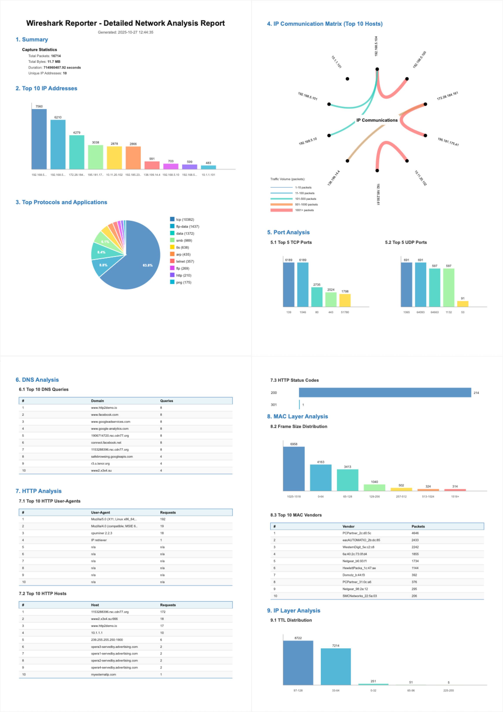
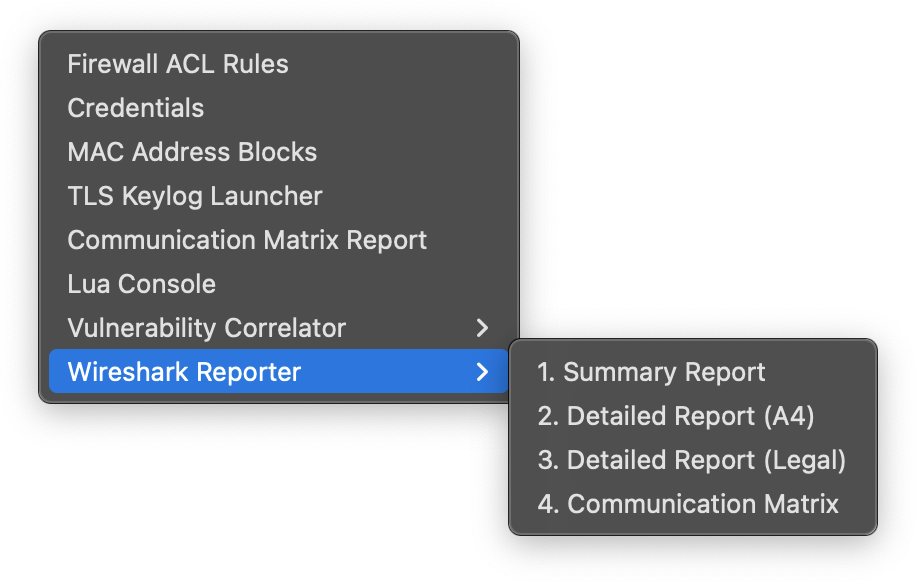
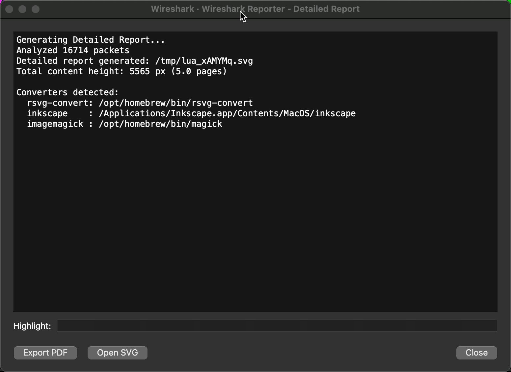

# Examples

This directory contains example outputs and sample usage scenarios for PacketReporter.

## Sample Reports

Place your example PDF reports here to demonstrate the plugin's capabilities:

- `example-summary-report.pdf` - Sample summary report
- `example-detailed-report-a4.pdf` - Sample detailed report (A4)
- `example-detailed-report-legal.pdf` - Sample detailed report (Legal)

## Sample PCAPs

You can use these sources for sample captures:

- **Wireshark Sample Captures**: https://wiki.wireshark.org/SampleCaptures
- **PacketLife**: https://packetlife.net/captures/
- **PCAP Repository**: https://www.netresec.com/index.ashx?page=PcapFiles

## Example Usage Scenarios

### Scenario 1: Web Traffic Analysis
```
1. Load http.pcap
2. Tools → PacketReporter → Detailed Report (A4)
3. Review HTTP Analysis section
4. Export PDF for documentation
```

### Scenario 2: DNS Investigation
```
1. Load capture.pcap
2. Apply filter: dns
3. Tools → PacketReporter → Detailed Report (A4)
4. Check DNS Analysis tables
```

### Scenario 3: Network Overview
```
1. Load network-capture.pcap
2. Tools → PacketReporter → Summary Report
3. Quick assessment of top talkers and protocols
4. Export PDF for quick reference
```

## Screenshots





